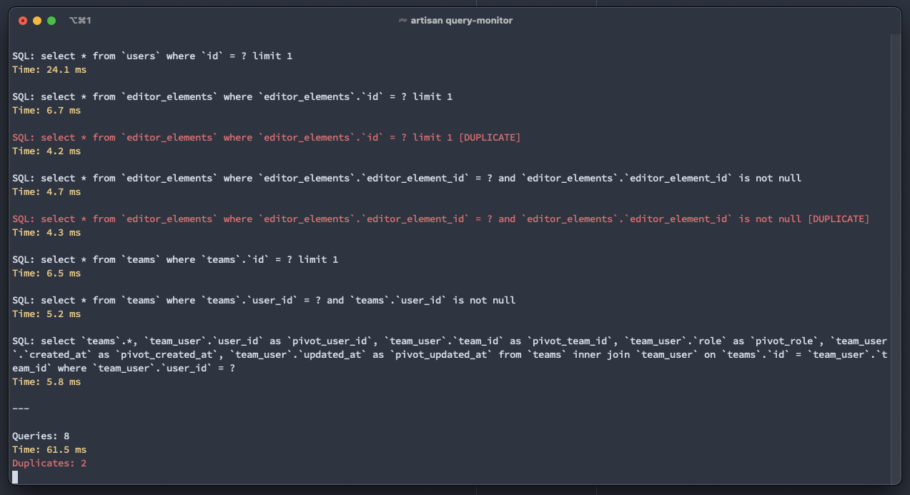

# authanram/laravel-query-monitor

Monitor executed queries via artisan command.



## Installation

You can install the package via composer.

```shell
composer require authanram/laravel-query-monitor
```

Add the following line to your applications `.env` file:

```
QUERY_MONITOR_ENABLED=true
```

Add the following line to your applications `.env` file, if you need to change the URI:

```
QUERY_MONITOR_URI=127.0.0.1:7777
```

## Usage

```shell
php artisan query-monitor
```

## Credits

- [Daniel Seuffer](https://github.com/authanram)
- [and Contributors](https://github.com/authanram/laravel-query-monitor/graphs/contributors) &nbsp;❤️

## License

The MIT License (MIT). Please see [License File](https://github.com/authanram/laravel-query-monitor/blob/master/LICENSE.md)
for more information.
